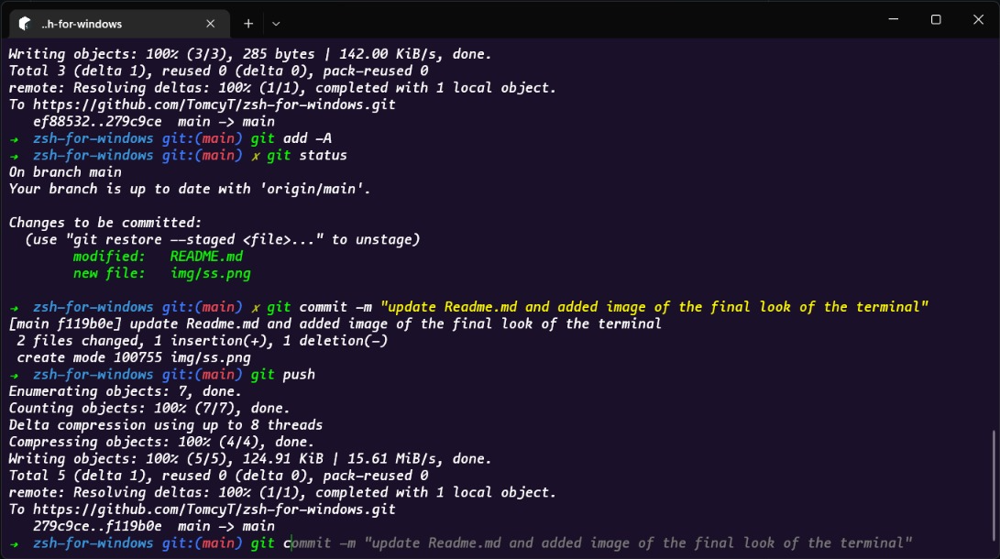

# ZSH for Windows

prolly the best way to get fancy and feature rich terminal to look cool among ur friends xD
## Installation
### 1. Cygwin
open source tool that allows Unix or Linux applications to be compiled and run on a Microsoft Windows operating system (OS) from within a Linux-like interface

*setup*

1. Download [Cygwin](https://cygwin.com/install.html) and install at default path
2. Click on next untill you reach the **packages screen**
3. Search for Lynx and expand All under Web select latest version of it under bin of wget no need to select Source. Then Continue.
4. Launch cygwin terminal and run the following commands to download and install apt-cyg

        lynx -source rawgit.com/transcode-open/apt-cyg/master/apt-cyg > apt-cyg
        install apt-cyg /bin
    
5. That's it with cygwin.

*If you want to change the default working folder then edit c:/cygwin64/etc/nsswitch.conf.* 

*open the file using any text editor and add the following lines to the end of file*

- Windows User path: 

```
db_home: windows
```

- custom path:
```
db_home: cygdrive/d/example/home/directory
```
### 2. ZSH
1. Open Cygwin Terminal
2. Run the following commands 

            apt-cyg install zsh
#### Lets now install the oh my zsh

1. Install **oh-my-zsh** the manual way, Run the lines one by one
        
         git clone git://github.com/robbyrussell/oh-my-zsh.git ~/.oh-my-zsh
         cp ~/.oh-my-zsh/templates/zshrc.zsh-template ~/.zshrc
- phewwwwww! you have successfully installed zsh
2. Now let's install some really useful plugins that'll make using commandline easier.

    - To install plugins just go to your root user folder, open `.zshrc` and you will find a variable plugins. Simply add the plugins you want to install with spaces `plugins=(git z zsh-autosuggestions)`
    - **Z** = saves the locations you visit the most, so that you can access it in one shot
    - **git** = brings many aliases in the command line
    - **Auto suggestions** = automatically suggests the code to type and autocomplete, has to be installed manually not internally available 
      run `git clone https://github.com/zsh-users/zsh-autosuggestions ${ZSH_CUSTOM:-~/.oh-my-zsh/custom}/plugins/zsh-autosuggestions`
    - **Syntax Highlighting** = Clone this repository in oh-my-zsh's plugins directory:
      `git clone https://github.com/zsh-users/zsh-syntax-highlighting.git ${ZSH_CUSTOM:-~/.oh-my-zsh/custom}/plugins/zsh-syntax-highlighting`

      Activate the plugin in `~/.zshrc`:

      `plugins=( [plugins...] zsh-syntax-highlighting)`

### 3.Setting up Windows terminal to use ZSH Shell
*Running cygwin on windows terminal to use zsh Shell*

- Open windows terminal settings and Add a new empty profile.
- Give it a name for eg: Zsh, and paste this in the commandline field
```
C:/cygwin64/bin/zsh.exe -i -l
```
- Give the starting location of your choice or leave it as it is.
- For zsh icon download the .ico file from the resources included and paste the path to it in the icon field.
- Lastly set zsh as the default profile to loaded on startup 
*For custom color scheme which im using* 

- Click on the open JSON file at the bottom of setting page
- under "Schemes" paste the following object: 
        
        {
            "background": "#1B1029",
            "black": "#0C0C0C",
            "blue": "#0037DA",
            "brightBlack": "#767676",
            "brightBlue": "#3B78FF",
            "brightCyan": "#3A96DD",
            "brightGreen": "#0DF802",
            "brightPurple": "#B4009E",
            "brightRed": "#E74856",
            "brightWhite": "#CBF9F5",
            "brightYellow": "#C3CC1A",
            "cursorColor": "#0DF802",
            "cyan": "#3A96DD",
            "foreground": "#FFFFFF",
            "green": "#0DF802",
            "name": "codingphase",
            "purple": "#881798",
            "red": "#C50F1F",
            "selectionBackground": "#FFFFFF",
            "white": "#CBF9F5",
            "yellow": "#FFFB00"
        }
- save the file and go to appearance and select codingphase from the colorScheme

*For changing the font to which im using*

- Download and install the theme provided in the resources.
- Change the font to mononokai under appearance fontface.

#### Thats it!!!!!! Now you have a custom terminal. Explore more about zsh plugins and other features on the internet to make your terminal more powerfull

## Acknowledgements

 - [Setting up Windows Terminal](https://theflying.dev/digital-garden/setting-up-windows-terminal/)
 - [Installing ZSH](https://github.com/ohmyzsh/ohmyzsh/wiki/Installing-ZSH)
 - [Installing ZSH on Windows](https://dev.to/zinox9/installing-zsh-on-windows-37em)
 - [How to Customize Windows 10 Terminal Like A Pro](https://www.youtube.com/watch?v=ialuEXkoKr0&t=621s)


